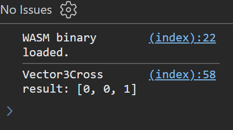

# WASM Vector3Cross Demo

This project demonstrates how to call an exported function from JavaScript that computes the cross product of two 3D vectors using DirectXMath.

Tested via WSL (Ubuntu).

## Overview

The project includes:

- **Demo.cpp:** A C++ source file that exports a function called `Vector3Cross` using DirectXMath.
The function takes pointers to three-element float arrays, computes the cross product of the first two arrays, and writes the result to a destination array.
- **index.html:** A minimal HTML5 page that loads the WASM module asynchronously using `WebAssembly.instantiateStreaming()`, sets up the memory layout, and calls the exported function.
- **Makefile:** A build script that compiles the C++ code to LLVM IR, then to a WASM object file, and finally links it into a WASM binary.

## Memory Layout and Pointer Passing

In WebAssembly, the linear memory is a contiguous, byte-addressable block that is exposed to JavaScript as an ArrayBuffer.

Pointers in WASM are represented as byte offsets into this memory. For example:

- A three-element float array occupies 3 × 4 = 12 bytes.
- In our code `Demo.cpp` and `index.html`:
  - **V1** is stored at indices 0–2 (byte offset 0),
  - **V2** is stored at indices 3–5 (byte offset 12),
  - **Destination** is stored at indices 6–8 (byte offset 24).

## Build & Use

Steps:

- Bootstrap yourself a Debian-based environment (e.g. Ubuntu via WSL)
- Install required packages (e.g. clang)
- Enter `make` in your terminal to build and run the demo
- Open a web browser (e.g. Edge) and visit `localhost:2323`
- Now, open your browser's console (to see the result)

## Screenshot

## Reference

For more details, see:

- [W3C WebAssembly Core Specification – Memory](https://www.w3.org/TR/wasm-core-2/#memory)
- [MDN: WebAssembly.Memory.prototype.buffer](https://developer.mozilla.org/en-US/docs/WebAssembly/Reference/JavaScript_interface/Memory/buffer)
- [WebAssembly lld port](https://lld.llvm.org/WebAssembly.html)
- [Compiling C to WebAssembly without Emscripten](https://surma.dev/things/c-to-webassembly/)
- [Getting Started: Building and Running Clang](https://clang.llvm.org/get_started.html)
